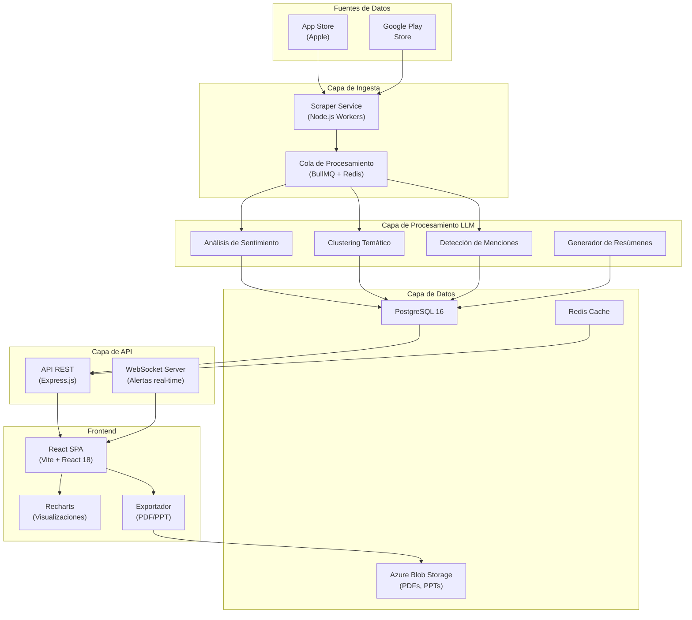
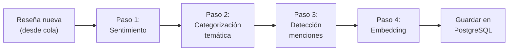
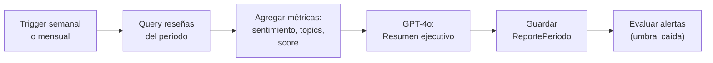
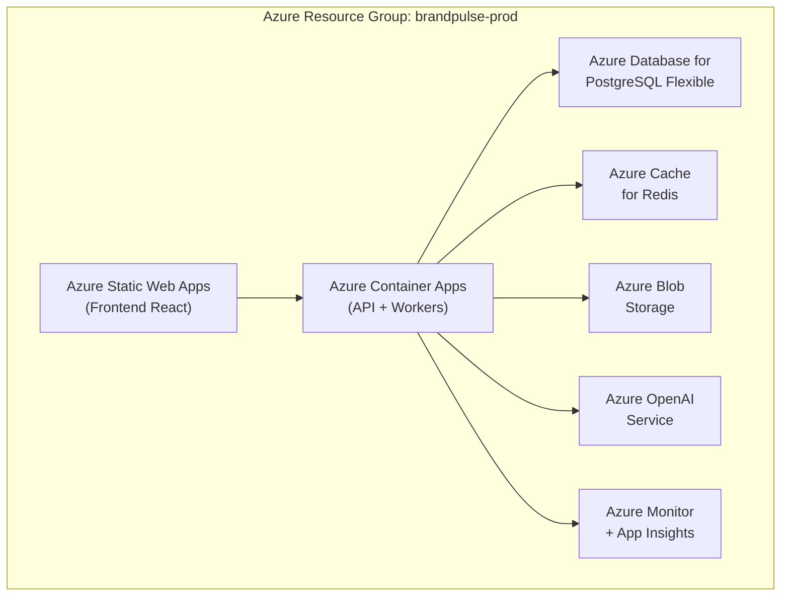

# BrandPulse — Arquitectura del Sistema

## 1. Visión General

BrandPulse es una plataforma de inteligencia de marca que captura reseñas de tiendas de aplicaciones, las analiza con LLM y presenta insights accionables a equipos de consultoría y clientes corporativos.

## 2. Diagrama de Arquitectura (Alto Nivel)



## 3. Componentes Detallados

### 3.1 Scraper Service (Ingesta de Reseñas)

| Aspecto | Decisión |
|---------|----------|
| **Google Play** | Librería `google-play-scraper` (npm) — scraping público, sin API key |
| **App Store** | Librería `app-store-scraper` (npm) — scraping del feed RSS público de Apple |
| **Orquestación** | Cron jobs con `node-cron` (cada 6 horas por defecto, configurable por cliente) |
| **Deduplicación** | Hash SHA-256 del `reviewId` nativo + `appId` como clave única |
| **Rate limiting** | Máximo 2 requests/segundo por store, con backoff exponencial |
| **Idioma** | Filtro por locale: `es`, `en`, `pt` (configurable por app) |

**Flujo de ingesta:**

```
1. Cron trigger → leer configuración del cliente desde PostgreSQL
2. Para cada app del cliente:
   a. Llamar scraper con parámetros (appId, lang, sort=NEWEST, num=500)
   b. Filtrar reseñas ya existentes (by reviewId hash)
   c. Insertar nuevas reseñas en tabla `reviews` con estado = 'pending'
   d. Encolar cada reseña nueva en BullMQ para análisis LLM
3. Registrar log de ingesta (total scraped, nuevas, duplicadas, errores)
```

### 3.2 Pipeline LLM

| Aspecto | Decisión |
|---------|----------|
| **Modelo** | OpenAI GPT-4o (vía API) — óptimo costo/calidad para español |
| **Fallback** | GPT-4o-mini para rebalanceo de carga o contingencia de costos |
| **Chunking** | Batch de 20 reseñas por llamada para clustering temático |
| **Embeddings** | `text-embedding-3-small` para búsqueda semántica futura |
| **Costo estimado** | ~$0.003/reseña (sentimiento + categorización individual) |

**Pipeline de procesamiento por reseña:**



**Pipeline de resumen periódico (batch):**



### 3.3 API Backend (Express.js)

**Endpoints principales:**

| Método | Ruta | Descripción |
|--------|------|-------------|
| `GET` | `/api/clients` | Lista clientes con sus apps |
| `POST` | `/api/clients` | Crear nuevo cliente + apps |
| `GET` | `/api/clients/:id/apps` | Apps de un cliente |
| `POST` | `/api/apps/:id/milestones` | Registrar hito de marca |
| `GET` | `/api/apps/:id/reviews` | Reseñas con filtros (fecha, rating, sentiment, topic) |
| `GET` | `/api/apps/:id/health-score` | Score de salud de marca (semanal/mensual) |
| `GET` | `/api/apps/:id/comparison` | Comparativa pre/post hito |
| `GET` | `/api/apps/:id/topics` | Top topics positivos/negativos |
| `GET` | `/api/apps/:id/alerts` | Alertas activas |
| `PUT` | `/api/alerts/:id/config` | Configurar umbrales de alerta |
| `GET` | `/api/apps/:id/reports` | Reportes periódicos |
| `POST` | `/api/apps/:id/reports/export` | Exportar reporte PDF/PPT |
| `POST` | `/api/ingestion/trigger` | Trigger manual de ingesta |
| `GET` | `/api/ingestion/status` | Estado del pipeline |

**Autenticación:** JWT con roles (`admin_minsait`, `analyst`, `client_viewer`).

### 3.4 Frontend (React + Vite)

| Aspecto | Decisión |
|---------|----------|
| **Framework** | React 18 con Vite 5 |
| **State management** | Zustand (ligero, sin boilerplate) |
| **Routing** | React Router v6 |
| **Gráficas** | Recharts (composable, buen soporte para custom themes) |
| **Tablas** | TanStack Table v8 |
| **Exportación PDF** | `@react-pdf/renderer` |
| **Exportación PPT** | `pptxgenjs` |
| **Estilos** | CSS Modules + variables CSS para tokens de diseño Minsait |
| **Tipografía** | Inter (Google Fonts) |

**Vistas principales:**

```
/                        → Dashboard global (todos los clientes)
/clients/:id             → Vista del cliente (lista de apps)
/apps/:id/dashboard      → Dashboard de impacto de la app
/apps/:id/reviews        → Explorador de reseñas con filtros
/apps/:id/comparison     → Comparativa pre/post hito
/apps/:id/reports        → Reportes periódicos generados
/apps/:id/alerts         → Configuración de alertas
/settings                → Gestión de clientes y configuración
```

### 3.5 Infraestructura (Azure)



| Recurso | SKU estimado | Costo mensual estimado |
|---------|-------------|----------------------|
| Container Apps | 2 vCPU, 4GB RAM × 2 instancias | ~$120 |
| PostgreSQL Flexible | Burstable B2s, 32GB | ~$65 |
| Redis Cache | Basic C0 | ~$25 |
| Blob Storage | LRS, 10GB | ~$2 |
| Azure OpenAI | GPT-4o, ~50K reseñas/mes | ~$150 |
| Static Web Apps | Free tier | $0 |
| **Total estimado** | | **~$362/mes** |

## 4. Seguridad

- **Datos en tránsito**: TLS 1.3 en todos los endpoints
- **Datos en reposo**: Cifrado AES-256 en PostgreSQL y Blob Storage (gestionado por Azure)
- **Autenticación**: JWT con refresh tokens, expiración 1h / refresh 7d
- **Autorización**: RBAC con 3 roles: `admin_minsait` (todo), `analyst` (lectura + configuración), `client_viewer` (solo lectura de su cliente)
- **API keys OpenAI**: Almacenadas en Azure Key Vault, nunca en código
- **Rate limiting API**: 100 req/min por usuario, 1000 req/min global
- **Logs de auditoría**: Todas las acciones de configuración se registran con usuario, timestamp e IP

## 5. Escalabilidad

| Dimensión | Estrategia |
|-----------|-----------|
| **Más clientes** | Multi-tenant por `client_id` en PostgreSQL, sin instancias separadas |
| **Más reseñas** | Workers horizontales en Container Apps (autoscaling por longitud de cola) |
| **Más análisis LLM** | Batch processing + fallback a GPT-4o-mini cuando la cola supere 10K |
| **Más datos históricos** | Particionamiento de tabla `reviews` por mes (`PARTITION BY RANGE`) |
| **Más fuentes** | Arquitectura de conectores: cada fuente es un módulo independiente en `/connectors/` |
