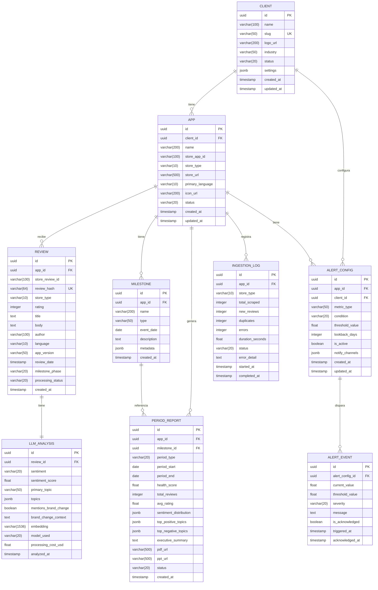

# BrandPulse — Diseño de Base de Datos

## 1. Diagrama Entidad-Relación



## 2. Detalle de Entidades

### 2.1 `clients` — Clientes de Minsait

```sql
CREATE TABLE clients (
    id              UUID PRIMARY KEY DEFAULT gen_random_uuid(),
    name            VARCHAR(100) NOT NULL,
    slug            VARCHAR(50) UNIQUE NOT NULL,       -- "banbif", "agora"
    logo_url        VARCHAR(200),
    industry        VARCHAR(50),                       -- "banking", "retail", "tech"
    status          VARCHAR(20) DEFAULT 'active',      -- active | paused | archived
    settings        JSONB DEFAULT '{}',                -- config específica del cliente
    created_at      TIMESTAMP DEFAULT NOW(),
    updated_at      TIMESTAMP DEFAULT NOW()
);

-- Ejemplo de settings:
-- {
--   "default_language": "es",
--   "report_frequency": "weekly",
--   "notify_emails": ["analista@minsait.com"],
--   "timezone": "America/Lima"
-- }
```

### 2.2 `apps` — Aplicaciones Monitoreadas

```sql
CREATE TABLE apps (
    id                UUID PRIMARY KEY DEFAULT gen_random_uuid(),
    client_id         UUID NOT NULL REFERENCES clients(id) ON DELETE CASCADE,
    name              VARCHAR(200) NOT NULL,
    store_app_id      VARCHAR(100) NOT NULL,           -- "com.banbif.app" o Apple ID numérico
    store_type        VARCHAR(10) NOT NULL,             -- 'play_store' | 'app_store'
    store_url         VARCHAR(500),
    primary_language  VARCHAR(10) DEFAULT 'es',
    icon_url          VARCHAR(200),
    status            VARCHAR(20) DEFAULT 'active',
    created_at        TIMESTAMP DEFAULT NOW(),
    updated_at        TIMESTAMP DEFAULT NOW(),

    UNIQUE(store_app_id, store_type)
);

CREATE INDEX idx_apps_client ON apps(client_id);
```

### 2.3 `milestones` — Hitos de Marca

```sql
CREATE TABLE milestones (
    id              UUID PRIMARY KEY DEFAULT gen_random_uuid(),
    app_id          UUID NOT NULL REFERENCES apps(id) ON DELETE CASCADE,
    name            VARCHAR(200) NOT NULL,             -- "Migración app v3.0"
    type            VARCHAR(50) NOT NULL,              -- 'app_migration' | 'rebranding' | 'feature_launch' | 'redesign'
    event_date      DATE NOT NULL,                     -- fecha del hito
    description     TEXT,
    metadata        JSONB DEFAULT '{}',                -- datos específicos del hito
    created_at      TIMESTAMP DEFAULT NOW()
);

CREATE INDEX idx_milestones_app ON milestones(app_id);
CREATE INDEX idx_milestones_date ON milestones(event_date);

-- Ejemplo metadata para BanBif:
-- {
--   "old_version": "2.x",
--   "new_version": "3.0",
--   "affected_platforms": ["android", "ios"],
--   "key_changes": ["nuevo diseño UX", "nuevo motor de pagos", "biometría"]
-- }
```

### 2.4 `reviews` — Reseñas Capturadas

```sql
CREATE TABLE reviews (
    id                  UUID PRIMARY KEY DEFAULT gen_random_uuid(),
    app_id              UUID NOT NULL REFERENCES apps(id) ON DELETE CASCADE,
    store_review_id     VARCHAR(100) NOT NULL,         -- ID nativo de la store
    review_hash         VARCHAR(64) UNIQUE NOT NULL,   -- SHA-256(store_review_id + store_type)
    store_type          VARCHAR(10) NOT NULL,
    rating              INTEGER NOT NULL CHECK (rating BETWEEN 1 AND 5),
    title               TEXT,                          -- solo App Store lo tiene
    body                TEXT NOT NULL,
    author              VARCHAR(100),
    language            VARCHAR(10) DEFAULT 'es',
    app_version         VARCHAR(50),
    review_date         TIMESTAMP NOT NULL,
    milestone_phase     VARCHAR(20),                   -- 'pre' | 'post' | null (calculado)
    processing_status   VARCHAR(20) DEFAULT 'pending', -- pending | processing | completed | failed
    created_at          TIMESTAMP DEFAULT NOW()
) PARTITION BY RANGE (review_date);

-- Particiones por trimestre
CREATE TABLE reviews_2025_q1 PARTITION OF reviews
    FOR VALUES FROM ('2025-01-01') TO ('2025-04-01');
CREATE TABLE reviews_2025_q2 PARTITION OF reviews
    FOR VALUES FROM ('2025-04-01') TO ('2025-07-01');
CREATE TABLE reviews_2025_q3 PARTITION OF reviews
    FOR VALUES FROM ('2025-07-01') TO ('2025-10-01');
CREATE TABLE reviews_2025_q4 PARTITION OF reviews
    FOR VALUES FROM ('2025-10-01') TO ('2026-01-01');
CREATE TABLE reviews_2026_q1 PARTITION OF reviews
    FOR VALUES FROM ('2026-01-01') TO ('2026-04-01');
CREATE TABLE reviews_2026_q2 PARTITION OF reviews
    FOR VALUES FROM ('2026-04-01') TO ('2026-07-01');

CREATE INDEX idx_reviews_app ON reviews(app_id);
CREATE INDEX idx_reviews_date ON reviews(review_date);
CREATE INDEX idx_reviews_rating ON reviews(rating);
CREATE INDEX idx_reviews_status ON reviews(processing_status);
CREATE INDEX idx_reviews_phase ON reviews(milestone_phase);
```

### 2.5 `llm_analyses` — Resultados del Análisis LLM

```sql
CREATE TABLE llm_analyses (
    id                      UUID PRIMARY KEY DEFAULT gen_random_uuid(),
    review_id               UUID UNIQUE NOT NULL REFERENCES reviews(id) ON DELETE CASCADE,
    sentiment               VARCHAR(20) NOT NULL,      -- 'positive' | 'negative' | 'neutral'
    sentiment_score         FLOAT NOT NULL,             -- -1.0 a 1.0
    primary_topic           VARCHAR(50) NOT NULL,       -- topic principal
    topics                  JSONB NOT NULL,             -- [{"topic": "ux", "confidence": 0.92}, ...]
    mentions_brand_change   BOOLEAN DEFAULT FALSE,
    brand_change_context    TEXT,                       -- extracto de la mención
    embedding               VECTOR(1536),              -- pgvector para búsqueda semántica
    model_used              VARCHAR(20) DEFAULT 'gpt-4o',
    processing_cost_usd     FLOAT DEFAULT 0,
    analyzed_at             TIMESTAMP DEFAULT NOW()
);

CREATE INDEX idx_llm_sentiment ON llm_analyses(sentiment);
CREATE INDEX idx_llm_topic ON llm_analyses(primary_topic);
CREATE INDEX idx_llm_mentions ON llm_analyses(mentions_brand_change);
CREATE INDEX idx_llm_embedding ON llm_analyses USING ivfflat (embedding vector_cosine_ops) WITH (lists = 100);
```

### 2.6 `period_reports` — Reportes Periódicos

```sql
CREATE TABLE period_reports (
    id                      UUID PRIMARY KEY DEFAULT gen_random_uuid(),
    app_id                  UUID NOT NULL REFERENCES apps(id) ON DELETE CASCADE,
    milestone_id            UUID REFERENCES milestones(id),
    period_type             VARCHAR(20) NOT NULL,      -- 'weekly' | 'monthly' | 'custom'
    period_start            DATE NOT NULL,
    period_end              DATE NOT NULL,
    health_score            FLOAT,                     -- 0–100
    total_reviews           INTEGER DEFAULT 0,
    avg_rating              FLOAT,
    sentiment_distribution  JSONB,                     -- {"positive": 45, "negative": 30, "neutral": 25}
    top_positive_topics     JSONB,                     -- [{"topic": "ux", "count": 23, "pct": 0.31}, ...]
    top_negative_topics     JSONB,
    executive_summary       TEXT,                      -- generado por LLM
    pdf_url                 VARCHAR(500),
    ppt_url                 VARCHAR(500),
    status                  VARCHAR(20) DEFAULT 'draft', -- draft | published
    created_at              TIMESTAMP DEFAULT NOW()
);

CREATE INDEX idx_reports_app ON period_reports(app_id);
CREATE INDEX idx_reports_period ON period_reports(period_start, period_end);
```

### 2.7 `alert_configs` + `alert_events` — Sistema de Alertas

```sql
CREATE TABLE alert_configs (
    id              UUID PRIMARY KEY DEFAULT gen_random_uuid(),
    app_id          UUID NOT NULL REFERENCES apps(id) ON DELETE CASCADE,
    client_id       UUID NOT NULL REFERENCES clients(id) ON DELETE CASCADE,
    metric_type     VARCHAR(50) NOT NULL,              -- 'health_score' | 'avg_rating' | 'negative_pct' | 'review_volume'
    condition       VARCHAR(20) NOT NULL,              -- 'drops_below' | 'exceeds' | 'changes_by_pct'
    threshold_value FLOAT NOT NULL,
    lookback_days   INTEGER DEFAULT 7,                 -- ventana de comparación
    is_active       BOOLEAN DEFAULT TRUE,
    notify_channels JSONB DEFAULT '["email"]',         -- ["email", "webhook", "slack"]
    created_at      TIMESTAMP DEFAULT NOW(),
    updated_at      TIMESTAMP DEFAULT NOW()
);

CREATE TABLE alert_events (
    id                UUID PRIMARY KEY DEFAULT gen_random_uuid(),
    alert_config_id   UUID NOT NULL REFERENCES alert_configs(id) ON DELETE CASCADE,
    current_value     FLOAT NOT NULL,
    threshold_value   FLOAT NOT NULL,
    severity          VARCHAR(20) DEFAULT 'warning',   -- 'info' | 'warning' | 'critical'
    message           TEXT NOT NULL,
    is_acknowledged   BOOLEAN DEFAULT FALSE,
    triggered_at      TIMESTAMP DEFAULT NOW(),
    acknowledged_at   TIMESTAMP
);

CREATE INDEX idx_alerts_active ON alert_events(is_acknowledged) WHERE is_acknowledged = FALSE;
```

### 2.8 `ingestion_logs` — Log de Ingesta

```sql
CREATE TABLE ingestion_logs (
    id              UUID PRIMARY KEY DEFAULT gen_random_uuid(),
    app_id          UUID NOT NULL REFERENCES apps(id) ON DELETE CASCADE,
    store_type      VARCHAR(10) NOT NULL,
    total_scraped   INTEGER DEFAULT 0,
    new_reviews     INTEGER DEFAULT 0,
    duplicates      INTEGER DEFAULT 0,
    errors          INTEGER DEFAULT 0,
    duration_seconds FLOAT,
    status          VARCHAR(20) DEFAULT 'running',     -- running | completed | failed
    error_detail    TEXT,
    started_at      TIMESTAMP DEFAULT NOW(),
    completed_at    TIMESTAMP
);
```

## 3. Extensión pgvector

```sql
-- Requerido para embeddings y búsqueda semántica
CREATE EXTENSION IF NOT EXISTS vector;
CREATE EXTENSION IF NOT EXISTS pgcrypto;  -- para gen_random_uuid()
```

## 4. Función de Cálculo de Fase (milestone_phase)

```sql
-- Función que asigna automáticamente la fase pre/post al insertar reseñas
CREATE OR REPLACE FUNCTION assign_milestone_phase()
RETURNS TRIGGER AS $$
DECLARE
    closest_milestone RECORD;
BEGIN
    SELECT id, event_date INTO closest_milestone
    FROM milestones
    WHERE app_id = NEW.app_id
    ORDER BY ABS(EXTRACT(EPOCH FROM (event_date - NEW.review_date::date)))
    LIMIT 1;

    IF closest_milestone IS NOT NULL THEN
        IF NEW.review_date::date < closest_milestone.event_date THEN
            NEW.milestone_phase := 'pre';
        ELSE
            NEW.milestone_phase := 'post';
        END IF;
    END IF;

    RETURN NEW;
END;
$$ LANGUAGE plpgsql;

CREATE TRIGGER trg_assign_phase
    BEFORE INSERT ON reviews
    FOR EACH ROW
    EXECUTE FUNCTION assign_milestone_phase();
```

## 5. Vista Materializada: Health Score Semanal

```sql
CREATE MATERIALIZED VIEW mv_weekly_health AS
SELECT
    r.app_id,
    DATE_TRUNC('week', r.review_date)::date AS week_start,
    COUNT(*) AS total_reviews,
    ROUND(AVG(r.rating), 2) AS avg_rating,
    ROUND(100.0 * COUNT(*) FILTER (WHERE la.sentiment = 'positive') / NULLIF(COUNT(*), 0), 1) AS positive_pct,
    ROUND(100.0 * COUNT(*) FILTER (WHERE la.sentiment = 'negative') / NULLIF(COUNT(*), 0), 1) AS negative_pct,
    ROUND(100.0 * COUNT(*) FILTER (WHERE la.sentiment = 'neutral') / NULLIF(COUNT(*), 0), 1) AS neutral_pct,
    -- Health Score = (avg_rating/5 * 40) + (positive_pct * 0.4) + ((100 - negative_pct) * 0.2)
    ROUND(
        (AVG(r.rating) / 5.0 * 40) +
        (100.0 * COUNT(*) FILTER (WHERE la.sentiment = 'positive') / NULLIF(COUNT(*), 0) * 0.4) +
        ((100 - 100.0 * COUNT(*) FILTER (WHERE la.sentiment = 'negative') / NULLIF(COUNT(*), 0)) * 0.2),
        1
    ) AS health_score
FROM reviews r
JOIN llm_analyses la ON la.review_id = r.id
WHERE r.processing_status = 'completed'
GROUP BY r.app_id, DATE_TRUNC('week', r.review_date)
ORDER BY week_start DESC;

CREATE UNIQUE INDEX idx_mv_weekly ON mv_weekly_health(app_id, week_start);

-- Refrescar cada hora (llamado desde cron del backend)
-- REFRESH MATERIALIZED VIEW CONCURRENTLY mv_weekly_health;
```

## 6. Datos Semilla

```sql
-- Insertar clientes iniciales
INSERT INTO clients (name, slug, industry) VALUES
    ('BanBif', 'banbif', 'banking'),
    ('Agora', 'agora', 'retail');

-- Insertar apps
INSERT INTO apps (client_id, name, store_app_id, store_type, primary_language) VALUES
    ((SELECT id FROM clients WHERE slug = 'banbif'), 'BanBif App', 'com.banbif.app', 'play_store', 'es'),
    ((SELECT id FROM clients WHERE slug = 'banbif'), 'BanBif App', '123456789', 'app_store', 'es'),
    ((SELECT id FROM clients WHERE slug = 'agora'), 'Agora App', 'com.agora.app', 'play_store', 'es');

-- Insertar hitos
INSERT INTO milestones (app_id, name, type, event_date, description) VALUES
    ((SELECT id FROM apps WHERE store_app_id = 'com.banbif.app'), 'Migración app v3.0', 'app_migration', '2026-03-15', 'Migración completa de la app bancaria con nuevo diseño UX y motor de pagos'),
    ((SELECT id FROM apps WHERE store_app_id = 'com.agora.app'), 'Rebranding corporativo', 'rebranding', '2026-04-01', 'Cambio completo de identidad visual: logo, colores, nombre en app');
```
