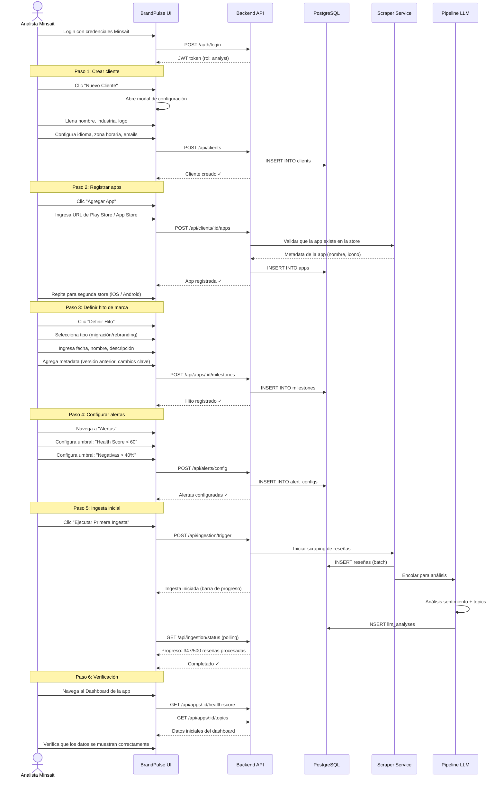
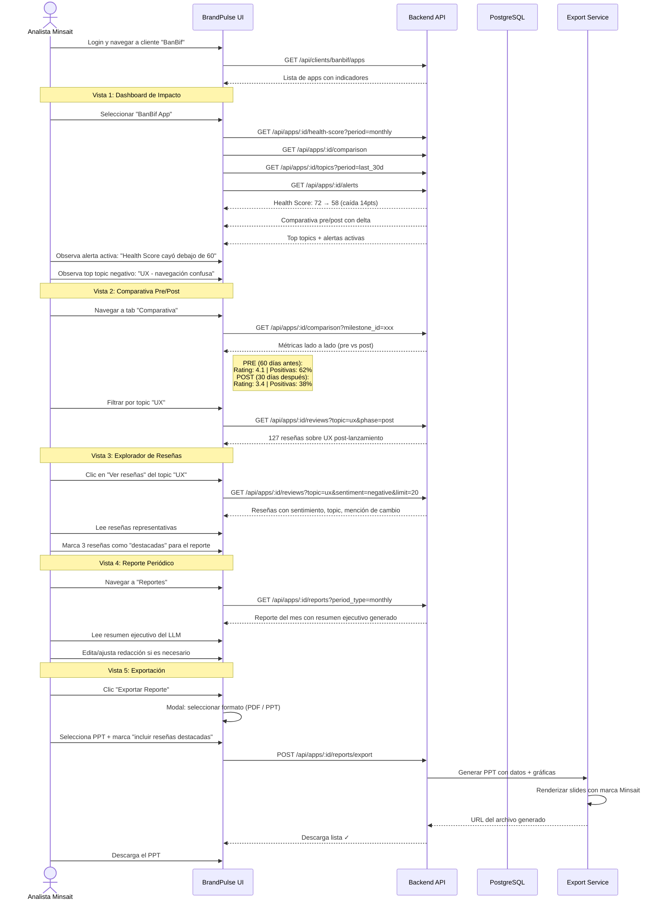
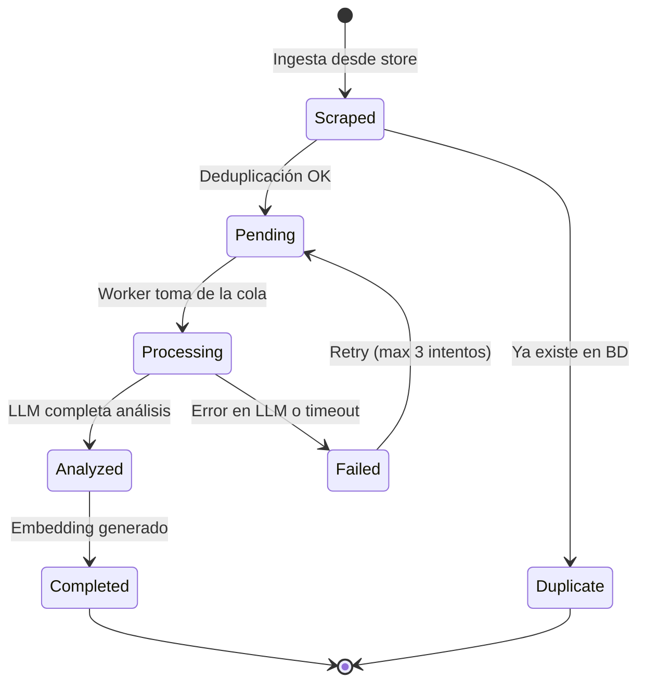

# BrandPulse — Flujos de Usuario Principales

## Flujo A: Analista de Minsait Configurando un Nuevo Cliente

### Contexto
Un analista de Minsait recibe el encargo de monitorear el impacto de marca de un nuevo cliente. Debe configurar el cliente, sus apps y el hito de marca en BrandPulse.

### Diagrama de Flujo



### Pantallas Involucradas

| Paso | Pantalla | Acción principal |
|------|---------|-----------------|
| 1 | `/settings` → Modal "Nuevo Cliente" | Formulario con nombre, industria, logo, config |
| 2 | `/clients/:id` → Modal "Agregar App" | URL de store + validación automática |
| 3 | `/apps/:id/dashboard` → Modal "Definir Hito" | Tipo, fecha, descripción, metadata |
| 4 | `/apps/:id/alerts` | Configuración de umbrales y canales |
| 5 | `/apps/:id/dashboard` → Botón "Ejecutar Ingesta" | Barra de progreso + log en tiempo real |
| 6 | `/apps/:id/dashboard` | Verificación visual de datos |

### Tiempo Estimado del Flujo
- **Configuración manual**: ~10 minutos
- **Ingesta inicial (500 reseñas)**: ~5 minutos (scraping) + ~15 minutos (análisis LLM)
- **Total hasta dashboard funcional**: ~30 minutos

---

## Flujo B: Visualización de Impacto Post-Lanzamiento

### Contexto
Han pasado 30 días desde el hito de marca. El analista de Minsait necesita preparar una presentación para el cliente con los resultados del impacto. Navega al dashboard de la app para extraer insights y exportar un reporte.

### Diagrama de Flujo



### Pantallas y Datos Mostrados

#### Dashboard de Impacto (`/apps/:id/dashboard`)

```
┌─────────────────────────────────────────────────────────────────┐
│  BanBif App — Dashboard de Impacto                              │
├─────────────┬──────────────┬──────────────┬────────────────────┤
│ Health Score│  Avg Rating  │  Total       │  Alertas           │
│    58/100   │    ★ 3.4     │  Reviews     │  2 activas         │
│   ▼ -14pts  │   ▼ -0.7     │    847       │  ⚠ Score < 60      │
│             │              │   ▲ +23%     │  ⚠ Negativas > 40% │
├─────────────┴──────────────┴──────────────┴────────────────────┤
│                                                                 │
│  [Gráfica: Health Score por semana — línea temporal]            │
│  ████████████████████████╮                                      │
│                           ╲                                     │
│                            ╲██████████████                      │
│  ──────────────────────── HITO ─────────────────────           │
│  Semana -8  -6  -4  -2   0   +2  +4  +6  +8                   │
│                                                                 │
├────────────────────────────┬────────────────────────────────────┤
│ Top Positivos              │ Top Negativos                      │
│ 1. Seguridad (+12%)       │ 1. UX - navegación (-31%)          │
│ 2. Velocidad (+8%)        │ 2. Estabilidad - crashes (-22%)    │
│ 3. Biometría (+15%)       │ 3. Funciones perdidas (-18%)       │
├────────────────────────────┴────────────────────────────────────┤
│ Resumen ejecutivo (generado por IA)                             │
│ "En los primeros 30 días post-migración, BanBif App registró   │
│  una caída significativa en percepción de usuario..."           │
└─────────────────────────────────────────────────────────────────┘
```

#### Comparativa Pre/Post (`/apps/:id/comparison`)

```
┌──────────────────────────────────────────────────────────┐
│  Comparativa: Pre-migración vs Post-migración            │
│  Hito: Migración app v3.0 (15 Mar 2026)                 │
├────────────────────┬──────────┬──────────┬──────────────┤
│ Métrica            │ PRE      │ POST     │ Delta        │
├────────────────────┼──────────┼──────────┼──────────────┤
│ Rating promedio    │ 4.1      │ 3.4      │ ▼ -0.7      │
│ Health Score       │ 72       │ 58       │ ▼ -14       │
│ % Positivas        │ 62%      │ 38%      │ ▼ -24pp     │
│ % Negativas        │ 18%      │ 41%      │ ▲ +23pp     │
│ Menciones cambio   │ 2%       │ 34%      │ ▲ +32pp     │
│ Topic #1 positivo  │ Fácil uso│ Seguridad│ —           │
│ Topic #1 negativo  │ Lentitud │ UX       │ —           │
│ Volumen semanal    │ 45       │ 89       │ ▲ +98%      │
└────────────────────┴──────────┴──────────┴──────────────┘
```

### Estructura del PPT Exportado

| Slide # | Contenido |
|---------|-----------|
| 1 | Portada con logo Minsait + nombre del cliente + período |
| 2 | Resumen ejecutivo (texto generado por LLM) |
| 3 | Health Score timeline con línea vertical del hito |
| 4 | Tabla comparativa pre/post (métricas principales) |
| 5 | Distribución de sentimiento (donut chart pre vs post) |
| 6 | Top 5 topics positivos con tendencia |
| 7 | Top 5 topics negativos con tendencia |
| 8 | Reseñas destacadas (3-5 reseñas textuales seleccionadas) |
| 9 | Menciones explícitas al cambio de marca (% y ejemplos) |
| 10 | Recomendaciones accionables |
| 11 | Próximos pasos y siguiente período de monitoreo |

---

## Diagrama de Estados de una Reseña


