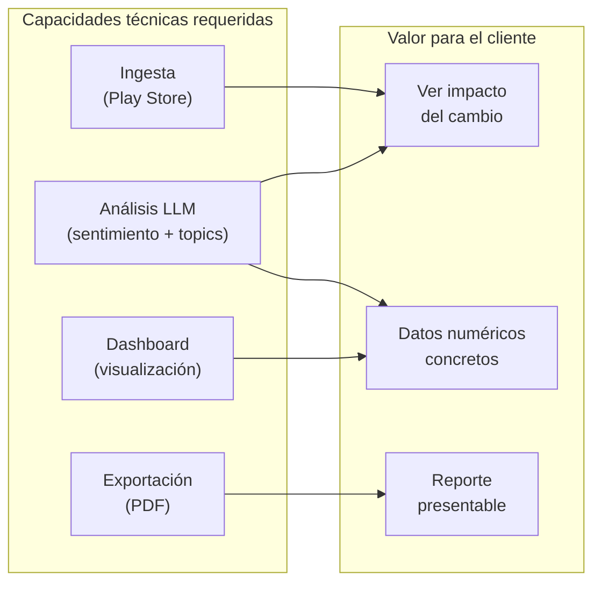

# BrandPulse — Propuesta de MVP

## 1. Definición del MVP

### Qué construir primero

El MVP de BrandPulse se enfoca en entregar **un ciclo completo de valor** para un solo cliente: desde la ingesta de reseñas hasta la exportación de un reporte accionable. Se prioriza profundidad sobre amplitud.

### Alcance del MVP

| Incluido en MVP | Excluido del MVP |
|-----------------|-----------------|
| ✅ 1 cliente activo (BanBif) | ❌ Multi-tenancy completo |
| ✅ Google Play Store (scraping) | ❌ App Store (requiere más trabajo de integración) |
| ✅ Análisis de sentimiento individual | ❌ Embeddings y búsqueda semántica |
| ✅ Clustering temático por batch | ❌ Clustering dinámico con categorías generativas |
| ✅ Detección de menciones al cambio | ❌ Resumen ejecutivo automático por LLM |
| ✅ Dashboard con Health Score semanal | ❌ Alertas automáticas con WebSocket |
| ✅ Comparativa pre/post hito | ❌ Exportación PPT |
| ✅ Tabla de reseñas con filtros | ❌ Roles y permisos (solo admin) |
| ✅ Exportación PDF básica | ❌ Integración con Slack/email |
| ✅ Ingesta manual (botón trigger) | ❌ Cron automatizado configurable |

### Justificación de Prioridad

**¿Por qué esta priorización?**

1. **Solo Google Play primero**: El 78% de usuarios de apps bancarias en Perú están en Android. Una sola store cubre la mayoría del mercado y reduce complejidad de scraping a la mitad.

2. **Solo BanBif primero**: Tiene un hito concreto (migración) con fecha definida. Es un caso de alto impacto que genera resultados visibles rápidamente. Agora se agrega en fase 2.

3. **Dashboard antes que alertas**: El equipo de Minsait necesita ver resultados para validar la plataforma. Las alertas son valiosas pero requieren un baseline de datos que aún no existe.

4. **PDF antes que PPT**: Un PDF de reporte cubre el 80% de las necesidades de presentación. PPT requiere diseño de slides con marca corporativa — es un esfuerzo extra que no bloquea la entrega de valor.

5. **Sin roles/permisos**: En el MVP, solo el equipo de Minsait usa la plataforma (3-5 personas). No se necesita RBAC hasta que haya clientes con acceso directo.

---

## 2. Fases de Desarrollo

### Fase 1: MVP (Semanas 1-6)

| Semana | Sprint | Entregable |
|--------|--------|-----------|
| 1-2 | **Sprint 1: Infraestructura + Ingesta** | PostgreSQL schema, API base, scraper de Google Play funcional, ingesta manual de reseñas de BanBif |
| 3-4 | **Sprint 2: Pipeline LLM + Análisis** | Prompts de sentimiento, clustering y detección de menciones. Workers de BullMQ. Procesamiento de 500 reseñas reales de BanBif |
| 5-6 | **Sprint 3: Dashboard + Exportación** | React dashboard con Health Score, comparativa pre/post, tabla de reseñas, exportación PDF básica |

### Fase 2: Post-MVP (Semanas 7-12)

| Semana | Sprint | Entregable |
|--------|--------|-----------|
| 7-8 | **Sprint 4: App Store + Agora** | Scraper de App Store, onboarding de Agora como segundo cliente, multi-tenancy básico |
| 9-10 | **Sprint 5: Resúmenes + Alertas** | Resumen ejecutivo automático por LLM, sistema de alertas con umbrales configurables |
| 11-12 | **Sprint 6: Exportación PPT + Roles** | Exportación PPT con slides de marca Minsait, RBAC con 3 roles, onboarding de `client_viewer` |

### Fase 3: Escalabilidad (Semanas 13-18)

- Cron de ingesta automatizado y configurable
- Embeddings + búsqueda semántica de reseñas
- Integración con Slack y email para alertas
- API pública para integración con herramientas del cliente
- Onboarding self-service para nuevos clientes

---

## 3. Métricas de Éxito del MVP (medibles en 90 días)

### Métricas de Producto

| Métrica | Objetivo a 90 días | Cómo se mide |
|---------|-------------------|-------------|
| **Reseñas procesadas** | ≥ 1,500 reseñas de BanBif analizadas | `SELECT COUNT(*) FROM reviews WHERE processing_status = 'completed' AND app_id = :banbif_id` |
| **Precisión de sentimiento** | ≥ 85% de acuerdo con clasificación manual (muestra de 100) | Auditoría manual: analista de Minsait revisa 100 reseñas y compara con clasificación del LLM |
| **Precisión de topics** | ≥ 80% de acuerdo con clasificación manual (muestra de 100) | Misma auditoría: topic principal correcto en ≥ 80 de 100 reseñas |
| **Precisión de detección de menciones** | ≥ 90% recall, ≥ 85% precision | Auditoría manual de 50 reseñas con mención y 50 sin mención |
| **Tiempo de procesamiento** | ≤ 20 minutos para procesar 500 reseñas | Log de `ingestion_logs.duration_seconds` + tiempo de workers LLM |
| **Uptime del dashboard** | ≥ 99% en horario laboral (8am-8pm Lima) | Azure Monitor / App Insights |

### Métricas de Uso

| Métrica | Objetivo a 90 días | Cómo se mide |
|---------|-------------------|-------------|
| **Reportes generados** | ≥ 4 reportes PDF exportados para BanBif | `SELECT COUNT(*) FROM period_reports WHERE pdf_url IS NOT NULL` |
| **Sesiones de dashboard** | ≥ 30 sesiones del equipo de Minsait en 90 días | Analytics del frontend (simple page view counter) |
| **Reseñas exploradas** | ≥ 200 reseñas vistas en detalle por analistas | Evento de click en "expandir reseña" en la tabla |
| **Insight citado en presentación al cliente** | ≥ 1 dato de BrandPulse incluido en presentación ejecutiva a BanBif | Cualitativo: confirmación del líder de cuenta |

### Métricas de Calidad de Insight

| Métrica | Objetivo a 90 días | Cómo se mide |
|---------|-------------------|-------------|
| **Health Score vs. Rating Store** | Correlación ≥ 0.7 entre Health Score y rating promedio de la store | Coeficiente de correlación de Pearson entre series temporales |
| **Detección de caída** | BrandPulse detectó la caída post-migración de BanBif dentro de las primeras 48 horas | Timestamp de primera alerta vs. fecha del hito |
| **Hallazgo accionable** | ≥ 1 hallazgo del análisis resultó en una acción del cliente (hotfix, comunicado, etc.) | Cualitativo: confirmación del equipo de producto de BanBif |

---

## 4. Stack Técnico del MVP

| Componente | Tecnología | Justificación |
|-----------|-----------|--------------|
| **Frontend** | React 18 + Vite 5 | Rápido de scaffoldear, equipo Minsait tiene experiencia React |
| **Gráficas** | Recharts | Composable, buen theming, paquete ligero |
| **Backend** | Node.js 20 + Express | Un solo lenguaje front+back, velocidad de desarrollo |
| **Base de datos** | PostgreSQL 16 | Relacional robusto, pgvector para futuro, particionamiento nativo |
| **Cola** | BullMQ + Redis | Probado en producción, dashboard de monitoreo incluido |
| **LLM** | OpenAI GPT-4o (API) | Mejor calidad en español, structured output confiable |
| **Scraping** | google-play-scraper (npm) | Mantenida activamente, ~2M descargas/semana |
| **PDF** | @react-pdf/renderer | Genera PDF desde React components, consistencia de diseño |
| **Deploy** | Azure Container Apps | PaaS con autoscaling, integración con Azure OpenAI si se necesita |
| **CI/CD** | GitHub Actions | Gratuito para repos privados (2000 min/mes), YAML simple |

---

## 5. Equipo Mínimo

| Rol | Dedicación | Responsabilidad |
|-----|-----------|----------------|
| **Fullstack Developer** | 100% | Frontend React + Backend Express + scraping |
| **ML/LLM Engineer** | 50% | Prompts, pipeline, evaluación de calidad |
| **Product Manager** | 25% | Priorización, validación con el cliente, métricas |
| **Tech Lead / Reviewer** | 10% | Code reviews, decisiones de arquitectura |

**Total**: ~1.85 FTE durante 6 semanas

---

## 6. Presupuesto del MVP

| Concepto | Costo estimado |
|---------|---------------|
| **Desarrollo** (1.85 FTE × 6 semanas) | Interno Minsait |
| **Azure infra** (6 semanas) | ~$550 |
| **OpenAI API** (1,500 reseñas) | ~$5 |
| **Dominio + SSL** | ~$15 |
| **Total infraestructura MVP** | **~$570** |

---

## 7. Criterios de Éxito / Go-No-Go para Fase 2

| Criterio | Umbral Go | Umbral No-Go |
|----------|----------|-------------|
| Precisión de sentimiento | ≥ 85% | < 75% |
| Reportes generados en 90 días | ≥ 4 | 0 |
| Feedback del equipo de cuenta BanBif | "Útil para presentar al cliente" | "No aporta valor vs. análisis manual" |
| Tiempo de setup de nuevo cliente | < 30 min | > 2 horas |
| Costo LLM mensual | < $50 | > $500 (algo está mal) |

Si se cumplen los criterios Go, se inicia Fase 2 con la adición de Agora y App Store. Si No-Go, se pivotea el enfoque (posiblemente hacia integración con APIs comerciales como AppFollow en lugar de scraping propio).
